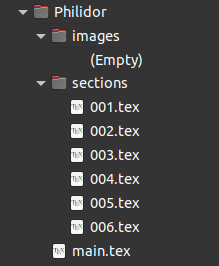

# pgn2tex

## What this site provides 
- a script `run_pgn2tex.py` that generates one TeX file from one chess PGN[^1] match, with a chessboard for each half move, and a 'main.tex' that collects all the sections TeX file, with this you can generate one PDF out of that bunch of TeX files.
  - the script processes all `*.pgn` files that it find at `PGN/` directory.
  - be aware, a PGN file can have thousends of games inside, and with this script each of its games will get a TeX file in `TEX/` directory
  - each game's TeX generation take about 1/2 seconds (on my old machine.)
    - a TeX to PDF generation of a single game in 'hatless' mode take about 60 sec for 4-5 PDF pages Din A4; e.g. the complete generation of the PDF  'Tata Steel Masters 2022' (1.300 pages) take about 4 hours.
  - my works here was not possible without [`python chess`](https://github.com/niklasf/python-chess) and for TeX / PDF generation: [`TeX Live`](https://www.tug.org/texlive/)

  

## My intention
... was to support myself learning chess by studying chess games offline, from selected PGN printouts / PDF files reading at any tablet, incl. making notes at the PDF's.

For online studies a good starting point learning chess is [lichess.org](https://lichess.org/) or others.
This approach provides a printout in B/W with more contrast as the colored PDFs at [lichess_puzzles_to_pdf](https://github.com/hlotze/lichess_puzzles_to_pdf).

I am not quite sure  even the bigger PDFs are usefull, as we have free online and offline tools that let us interactively play (incl. analysis; see SCID etc.) the PGN files.

That project allows me to play with all that free tools, we have today: Linux OS (Debian, Ubuntu), Github, VScode, Python3 / Jupyter, LaTeX, LibreOffice etc.

## Steps
- Initially please have a look at 
  - the PGN[^1] examples; see `PGN/`
  - the TeX examples; see `TEX/`
  - the PDF examples; see `PDF/`
  - requirements.txt for the venv or pipenv (which I prefer)

- install a python3 (e.g. 3.9.5 or better)
- clone / download that code from the repo
- run the Python script `run_pgn2tex.py`; its will generate TeX files only
- install a TeX Live with its editor's TeX Maker or TeX Works
- use your prefered TeX editor (TeX Maker, TeX Works, others) and generate the PDF file from a TeX file
- or use batch mode aka 'hatless' command `latexmk --gg -pdf` within your `TEX/` folder at the console prompt

## Open item
- [x] add ECO Opening diagram to each game's TeX
- [x] collect all games' TeX files to multiple TeX file(s) using TeX `\subfile{}` machanism, so that we got one PDF 
  - [x] add a TOC
  - [x] add PDF outline headline at \section (= Date, Event, Site), \subsection (= Players, Result, ECO)
- [ ] complete testing
- [ ] documentation, e.g. wiki 
- [ ] to fix/optimize: some Openings code and wording does not match to given ECO's code or wording, seen there are multiple versions of ECO
- [x] layout enhancements, in most cases 1st page shows the game moves in figurine long notation and the Opening, 2nd page give all halfmoves diagrams

## Contact
[@hlotze](https://github.com/hlotze)

## Footnotes
[^1]: PGN - see [Wikipedia Portable Game Notation](https://en.wikipedia.org/wiki/Portable_Game_Notation)

[^2]: ECO - see [Wikipedia: Encyclopaedia of Chess Openings](https://en.wikipedia.org/wiki/List_of_chess_openings) or a [Detailed opening library](https://www3.diism.unisi.it/~addabbo/ECO_aperture_scacchi.html)

[^3]: chess evaluation - see [chessprogramming.org/Evaluation](https://www.chessprogramming.org/Evaluation)

[^4]: SAN - see [Wikipedia: Algebraic_notation_(chess)](https://en.wikipedia.org/wiki/Algebraic_notation_(chess))

[^5]: TTF - see [Wikipedia: TrueType](https://en.wikipedia.org/wiki/TrueType)

